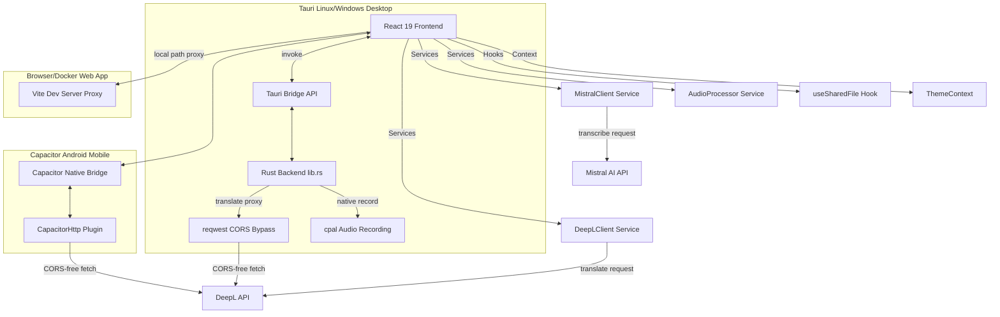

# System Architecture

TranscribeJS is built as a single-page React application that scales across Web, Desktop (Tauri), and Mobile (Capacitor) using a modular architecture.

---

## 1. High-Level Architecture Overview



---

## 2. Core Service Components

### 2.1 Audio Processing Pipeline (`AudioProcessor.ts`)

The React application uses the Web Audio API inside [AudioProcessor.ts](file:///home/joel/progetti/SpeechForge/src/services/audio/AudioProcessor.ts) to normalize and prepare files prior to sending them to Mistral AI. The processing pipeline runs as follows:

1. **Decoding:** The uploaded file's raw array buffer is decoded into an `AudioBuffer` via the browser's `AudioContext.decodeAudioData`.
2. **Channel Downmixing (Mono):** If the input file has multiple channels, they are mixed into a single mono channel by averaging the sample values across all channels:
   $$\text{MonoSample}[i] = \frac{1}{N} \sum_{c=1}^N \text{ChannelSample}_c[i]$$
3. **Resampling:** The audio sample rate is converted to a standard `16000 Hz` using an `OfflineAudioContext` for rendering.
4. **PCM 16-bit WAV Encoding:** The 32-bit floating point samples are clamped between $[-1.0, 1.0]$ and quantized into 16-bit signed integers:
   $$\text{QuantizedSample} = \text{clamp}(s, -1, 1) \times 32767$$
   A standard 44-byte RIFF/WAVE header is generated and appended to the byte buffer.
5. **Overlapping Chunk Splitting:** If the duration exceeds 900 seconds (15 minutes), the processor splits the audio samples into 15-minute segments with a 3-second overlap. This prevents API timeout errors and stays within file size limits.

### 2.2 Dual Recording Paths

Microphone recording has two parallel implementations configured in [App.tsx](file:///home/joel/progetti/SpeechForge/src/App.tsx) due to platform limitations:

* **Tauri Desktop Linux Path:** The Linux Webview (WebKit2GTK) does not support reliable WebRTC microphone access. When running under Tauri on Linux:
  - React invokes the Tauri backend command `start_native_recording`.
  - The Rust backend [lib.rs](file:///home/joel/progetti/SpeechForge/src-tauri/src/lib.rs) captures microphone inputs via `cpal` inside a dedicated background thread, handling `f32`, `i16`, and `u16` inputs.
  - When React invokes `stop_native_recording`, Rust terminates the thread, compiles PCM WAV bytes using `hound`, and returns them directly to React as a byte array (`Vec<u8>`).
* **Web, Windows Desktop, & Capacitor Path:** Uses standard browser `navigator.mediaDevices.getUserMedia()` and the `MediaRecorder` API to capture audio into `webm`, `ogg`, or `mp4` containers.

---

## 3. Platform Integrations & CORS Workarounds

The Mistral and DeepL APIs do not configure permissive CORS headers (`Access-Control-Allow-Origin`). Thus, direct browser-to-API requests fail in browser contexts. We implement three separate CORS-bypassing pathways inside [deepLClient.ts](file:///home/joel/progetti/SpeechForge/src/services/deepl/deepLClient.ts) and [MistralClient.ts](file:///home/joel/progetti/SpeechForge/src/services/mistral/MistralClient.ts):

| Runtime Platform | CORS Bypass Strategy | Technology |
| :--- | :--- | :--- |
| **Tauri Desktop** | Tauri commands delegate HTTP calls to Rust. | Rust `reqwest` client |
| **Capacitor Mobile** | Native HTTP bridging bypasses Webview CORS constraints. | `@capacitor/core` `CapacitorHttp` |
| **Web Browser** | Vite dev server / production proxy forwards traffic. | Dev proxy configuration |

### Tauri Rust Translation Bypass

```rust
#[tauri::command]
async fn deepl_request(
    url: String,
    method: String,
    headers: std::collections::HashMap<String, String>,
    body: Option<String>,
) -> Result<serde_json::Value, String> {
    // Spawns reqwest thread out of process (CORS is a browser-only restriction)
    ...
}
```

---

## 4. Mobile System Integration (`useSharedFile.ts`)

For mobile (Android) setups, the application implements a system-level share handler hook [useSharedFile.ts](file:///home/joel/progetti/SpeechForge/src/hooks/useSharedFile.ts). 

* When another app shares an audio file with TranscribeJS, Capacitor triggers a native event.
* The hook intercepts `sharedFileReceived` events, decodes the base64 content payload back into bytes, instantiates a React `File` object, and automatically starts the transcription pipeline.
* If a file is shared before the React application finishes booting, it is buffered into `window.__TRANSCRIBE_PENDING_SHARED_FILE__` and consumed immediately upon startup.
